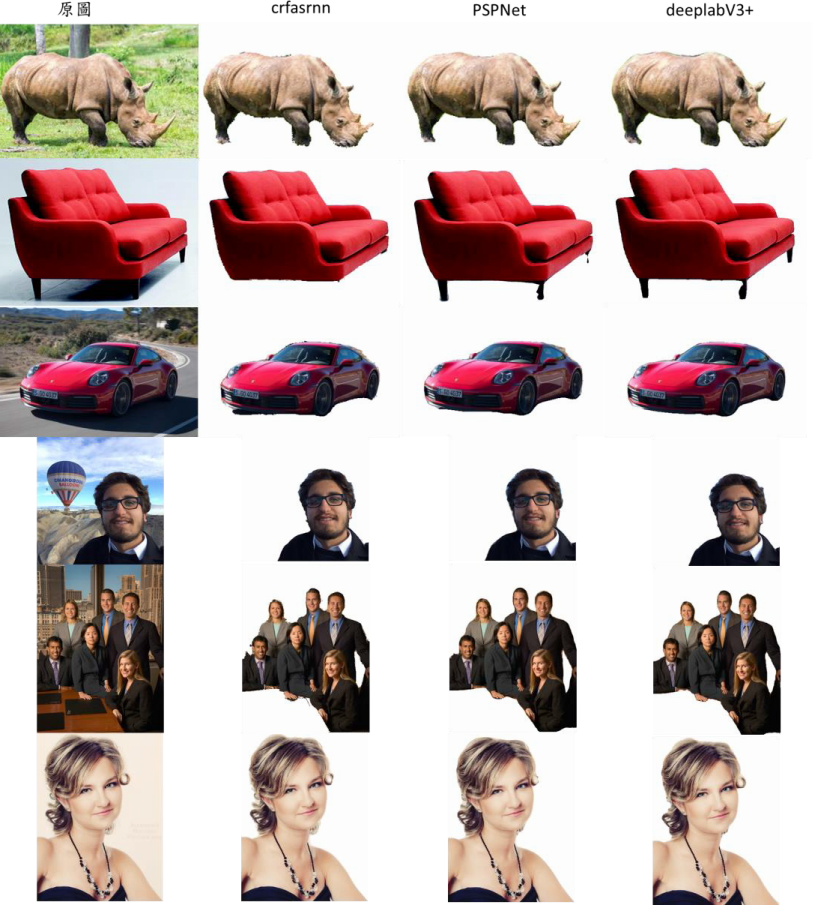
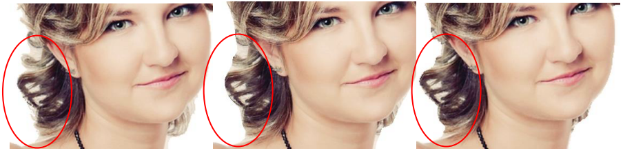
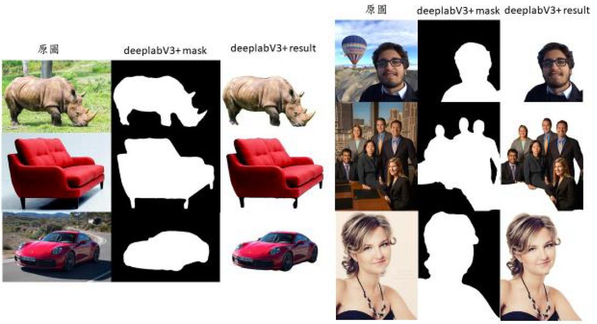
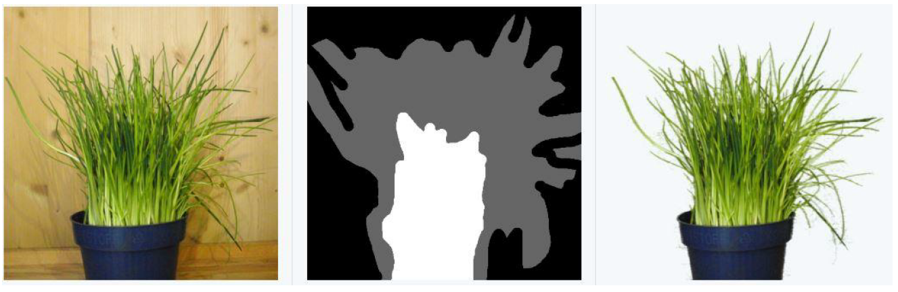
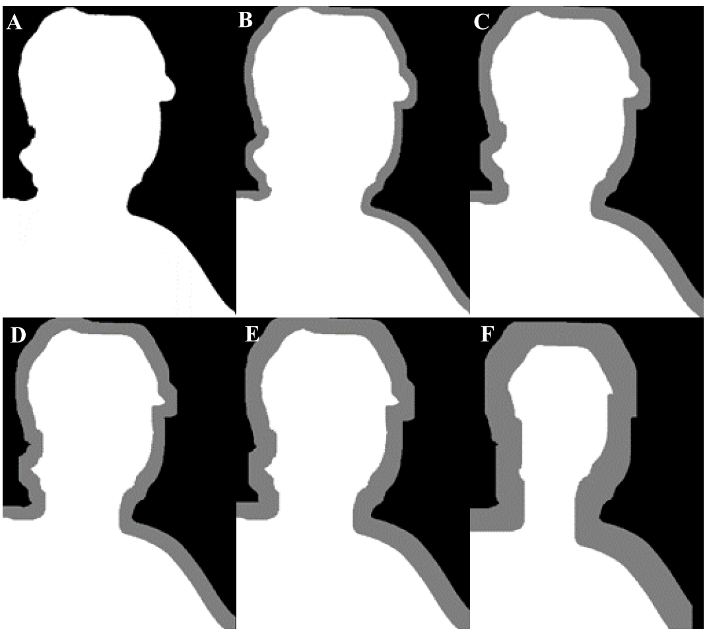
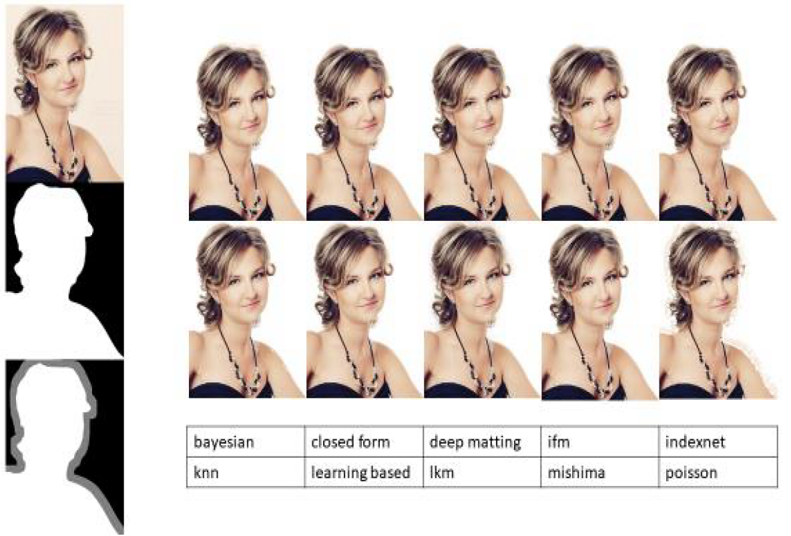
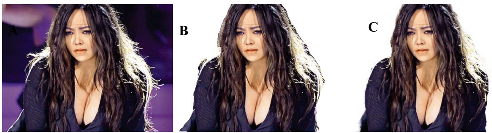
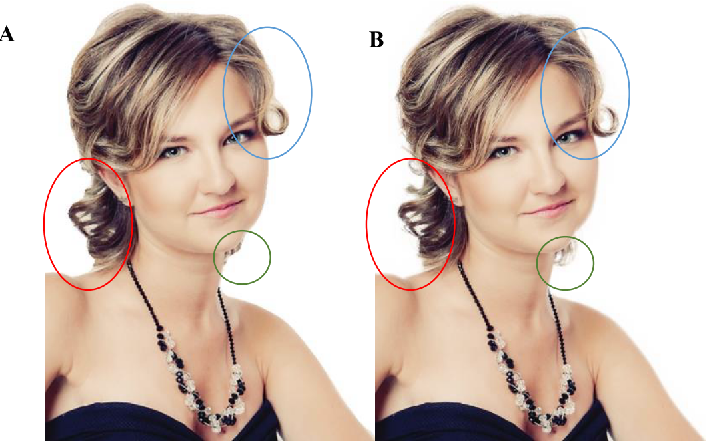

## 簡介
開源智造使用Google最新版的DeepLab v3+，搭配Automatic Trimap Generator，以及使用目前開源代碼中最高名次的matting方法(下表) Deep Image Matting，成功整合Image Segmentation, Trimap自動生成器與Image Matting，創造出一套全自動髮絲去背AI模型，我們將之取名為Auto Hair。  

| method | github | python file |
|-------|:-----:|------:|
| Deep-Image-Matting   |  <https://github.com/foamliu/Deep-Image-Matting>  |   data_generator.py |
| Automatic Trimap Generator   |  <https://github.com/lnugraha/trimap_generator>  |   trimap_module.py |
| unet-gan-matting   |  <https://github.com/eti-p-doray/unet-gan-matting>  |   combine.py |
| Semantic Human Matting   |  <https://github.com/lizhengwei1992/Semantic_Human_Matting>  |   gen_trimap.py |

## 髮絲圖片去背技術架構及執行方法
圖片去背通常有兩種類型，分別是Image Segmentation (IS) 與Image Mat-ting (IM)。IS主要著重在對每個像素的語義理解，並得到該像素分類結果，但缺點是很難滿足標的物邊緣高精度的切割效果。Image Matting主要著重在找出前景與背景的顏色，以及它們之間的融合程度，在像素邊緣的分割效果更加自然，但其缺點是需要人工耗時繪製Trimap圖，來確定圖像中前景、背景與不確定區域。經過研究和實驗，開源智造提出了一個全新的模式，以達成「髮絲」的精準去背。我們 (1) 使用Google最新版的DeepLab v3+ (2) 搭配 Automatic Trimap Generator [1]，以及(3) 使用目前開源代碼中最高名次的matting方法Deep Image Matting  [2]。最終我們成功整合Image Segmentation, Trimap自動生成器與Image Matting，創造出一套全自動髮絲去背演算法，我們將之取名為Auto Hair。
在我們研究的文獻中，尚未有人嘗試將此三種方法進行結合。以下我們將針對(A) Mask, (B) Trimap, (C) Image Matting的執行方法做細部說明。

#### (A) Mask
目前已超過百個Image Segmentation的架構，針對其中有Open Source的30多種演算法 我們做了全面的測試及實作上的比較。我們在此列舉三個演算法 (CRF-RNN、PSPNET和Deeplab v3+) 的測試效果[3]。如下圖，CRF-RNN、PSPNET和DeepLab v3+，在6種範例圖檔中去背效果均不錯。  
  

仔細觀察可發現DeepLab v3+的結果又比另外兩種效果更好。仔細觀察可以發現，在沙發的範例中，椅腳在CRF-RNN的結果中完全消失，而在PSPNET則消失了一部分。再來，在車子的範例中，車底陰影的去背效果也是以DeepLab v3+為最佳。針對有髮絲的女性圖片來做比較，將三種去背結果的放大後 (如下圖)，可發現DeepLab v3+最貼近標的物邊緣，背景成分也更少。  

即使DeepLab v3+的去背成效已經不錯，可以看到頭髮之間仍然存在背景圖案。為了達成「有髮絲效果」的精準去背，我們利用DeepLab v3+所產生的遮罩圖(mask，如下圖)，進行第二次去背的優化。  
  

#### (B) Trimap
Image Matting是人工手動描繪出需要被提取的物件邊緣，產生Trimap，再利用公式求得圖片的相關參數。如下圖，一旦有了Trimap之後，Image Matting要做的分析就是針對灰色區域中的未知像素，判斷這些未知像素哪些是前景跟背景。  
  

通常Trimap是人為繪製黑灰白的三向圖。黑色的地方是確定的背景(Definite Background)，白色的是確定的前景(Definite Foreground)，灰色則是不確定的部分(Unknown)。要繪製出精確的Trimap並不容易，需要設計師花費相當多的時間。經過大量的搜尋，我們找到4種可產生Trimap的開源代碼。我們團隊做了深入的比較，最後決定採用Automatic Trimap Generator的方法，其特點是遮罩圖(mask)邊緣的內縮與外擴單位向量可自行決定，詳下圖。  
  

#### (C) Image Matting
Image Matting已經有不少學術論文和開源演算法，我們團隊將開源的python程式碼做了整理，詳見下表。  

| method | link |
|-------|:-----:|
| Deep Image Matting   |  <https://github.com/huochaitiantang/pytorch-deep-image-matting>  |
| Indexnet matting   |  <https://github.com/poppinace/indexnet_matting/>  |
| Fusion Matting   |  <https://github.com/yunkezhang/FusionMatting>  |
| Learning-based Sampling   |  <http://yaksoy.github.io/samplenet/>  |
| KNN-matting   |  <https://github.com/MarcoForte/knn-matting>  |
| bayesian-matting   |  <https://github.com/MarcoForte/bayesian-matting/>  |
| learning-based-matting   |  <https://github.com/MarcoForte/learning-based-matting>  |
| poisson-matting   |  <https://github.com/MarcoForte/poisson-matting>  |
| mishima-matting   |  <https://github.com/MarcoForte/mishima-matting>  |
| closed-form-matting   |  <https://github.com/MarcoForte/closed-form-matting>  |
| Lkm matting   |  <https://github.com/99991/matting>  |
| LFM matting   |  <https://github.com/99991/matting>  |
| AlphaGAN-Matting   |  <https://github.com/CDOTAD/AlphaGAN-Matting>  |
| unet-gan-matting   |  <https://github.com/eti-p-doray/unet-gan-matting>  |

由於不同形式的Trimap配上不同的matting方法效果差異極大，我們投入了大量的時間，並善用TWCC的運算資源，針對各種組合進行分析， 下圖為比較結果的範例之一。透過仔細的觀察，最終我們找出當前效果最佳的組合，即用DeepLab v3+萃取出的遮罩，自動產生的Trimap，並搭配Deep Image Matting，這樣的架構可以達成自動化髮絲去背的細緻效果，而不再需要人工介入。
  

如下圖所示， Auto Hair的髮絲去背成果比DeepLab v3+細緻和自然很多。而且，Auto Hair不只是邊緣的效果增強了，甚至還原了原本Image Segmentation (即DeepLab v3+)步驟中丟失的捲髮區塊 (如圖的綠色圓圈部位)。  
  
  

[1] https://github.com/lnugraha/trimap_generator  
[2] https://github.com/huochaitiantang/pytorch-deep-image-matting  
[3] http://host.robots.ox.ac.uk/leaderboard/displaylb.php?challengeid=11  

## download large size model from here:
https://drive.google.com/open?id=1AwQyecC3I8lsYIjxRR4CuTfa5rMCOmGA  
https://drive.google.com/open?id=1oTjRxUixcB2F8OiNrhjrRy92Dq7xXNsZ
